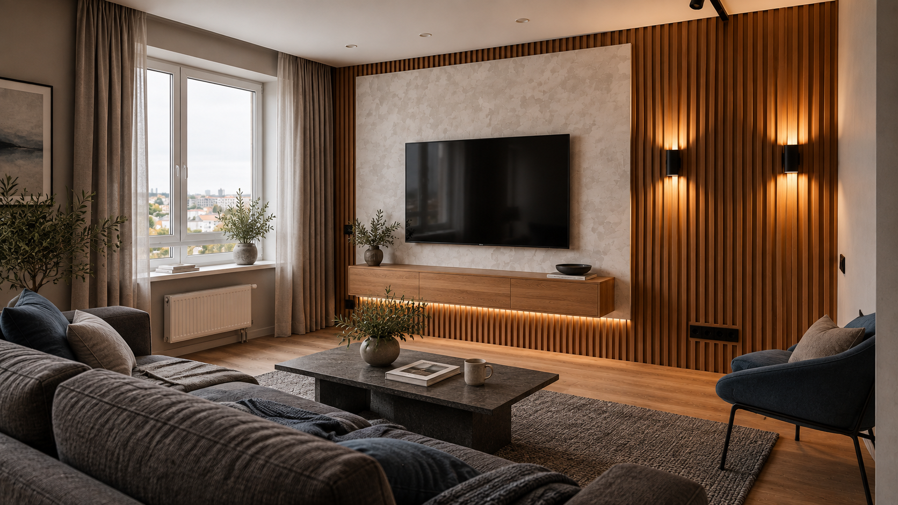
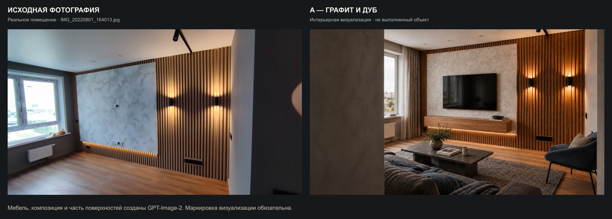
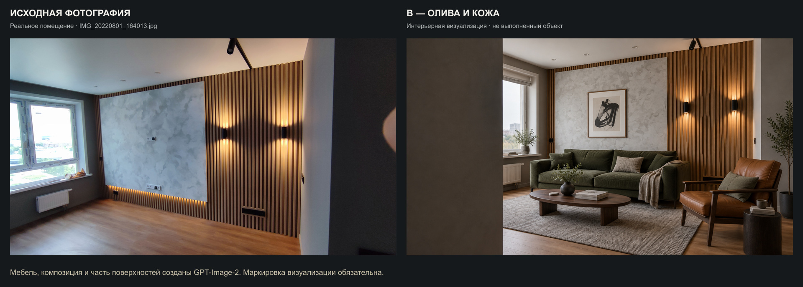
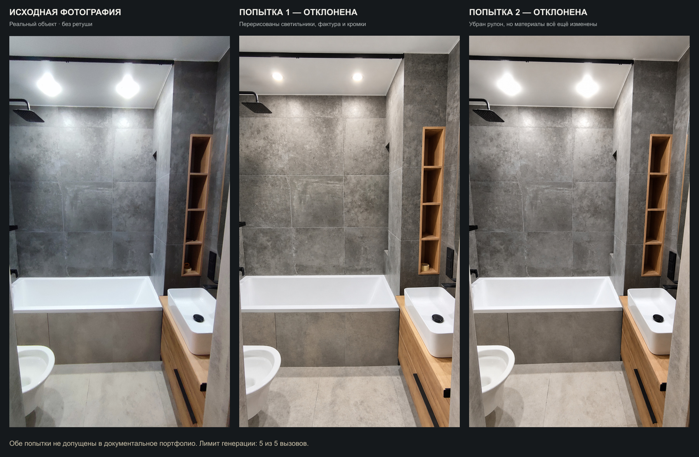

# Statum — Premium pilot

Дата: 2026-09-08. Статус: **пользователь предпочёл первую версию A; в сайт не интегрирован**. Основание — новый бриф пользователя, разрешающий самостоятельные рекламные визуализации и заметную ретушь документальных фото. Прежняя рекомендация об отказе от генерации не является утверждённым решением. [Бриф]

## Выбранный визуальный ориентир

Пользователь отметил «Это изображение получилось лучше всего», приложив первую версию A — [hero-a-graphite-living-v1.png](visualizations/hero-a-graphite-living-v1.png). Именно этот файл фиксируется как предпочтительное направление: видимое окно слева, полная композиция гостиной, графитовый текстиль, дуб и тёплый локальный свет. Это рекламная интерьерная визуализация. Выбор направления не означает поручения на интеграцию или новую генерацию. [Бриф] [Материалы]

## Итог

- Подготовлены два рекламных направления: A «Графит и дуб», B «Олива и кожа». Пользователь предпочёл первоначальную версию A. [Бриф]
- Для одной реальной фотографии санузла выполнены две попытки генеративной ретуши. Обе **отклонены для документального портфолио**: модель изменила фактуру материалов и кромки.
- Выполнено ровно **5 из 5** разрешённых вызовов. Дополнительная генерация остановлена. Полный набор запросов: [prompt-set.md](prompt-set.md); происхождение, размеры и SHA-256: [provenance.json](provenance.json).
- Использован встроенный image_gen. В C2PA-метаданных PNG указаны gpt-image и version 2.0. Исходники переданы как изображения через referenced_image_paths, а не только описаны текстом. [Материалы]
- Оригиналы, подготовленные ранее ресурсы и код сайта на этом этапе не изменялись. [Бриф]

## Результаты и происхождение

| Файл                                                                          | Источник                                                                                                                    | Назначение / статус                                                             |
| ----------------------------------------------------------------------------- | --------------------------------------------------------------------------------------------------------------------------- | ------------------------------------------------------------------------------- |
| [hero-a-graphite-living.png](visualizations/hero-a-graphite-living.png)       | design/img/IMG_20220801_164013.jpg + вспомогательный src/assets/images/hero/hero-main.png, затем одна композиционная правка | Рекламная интерьерная визуализация, Hero A; 1672 × 941, приблизительно 16:9     |
| [hero-b-olive-reading.png](visualizations/hero-b-olive-reading.png)           | design/img/IMG_20220801_164013.jpg                                                                                          | Рекламная интерьерная визуализация, Hero B; 1672 × 941, приблизительно 16:9     |
| [hero-a-graphite-living-v1.png](visualizations/hero-a-graphite-living-v1.png) | Те же исходники, что у A                                                                                                    | Выбранный пользователем визуальный ориентир; рекламная визуализация, 1672 × 941 |
| [bathroom-retouch-v1.png](rejected/bathroom-retouch-v1.png)                   | design/img/IMG_20220801_154610.jpg                                                                                          | Отклонённая ретушь: 941 × 1672                                                  |
| [bathroom-retouch-v2.png](rejected/bathroom-retouch-v2.png)                   | Тот же оригинал, новая попытка с усиленными ограничениями                                                                   | Отклонённая ретушь: 941 × 1672                                                  |

Отдельный каталог documentary не содержит принятой фотографии: файл не проходит туда автоматически только потому, что был запрошен как ретушь. Все пять PNG скопированы без повторного сжатия из каталога generated_images; metadata сохранены. [Материалы]

## Сцены Hero

**A — Графит и дуб.** Гостиная для отдыха и просмотра кино: графитовый тканевый диван в переднем плане, кресло цвета сланца, тёмный каменный столик, шерстяной ковёр, дубовая тумба и ТВ. Свет из существующего окна слева сочетается с тёплыми бра. В выбранной первой версии окно и интерьер показаны полностью. В альтернативной доработке hero-a-graphite-living.png слева создана передняя плоскость стены под текст; пользователь предпочёл первоначальную композицию. [Материалы] [Бриф]

**B — Олива и кожа.** Гостиная для чтения и общения: оливковый диван, кожаное кресло коньячного оттенка, овальный деревянный стол, графичный рисунок вместо ТВ. Это альтернативное направление пилота. Первоначальная рекомендация B заменена зафиксированным предпочтением пользователя — первой версией A. [Материалы] [Бриф]

Оба изображения сохраняют узнаваемую идею исходной комнаты, но меняют обстановку, отдельные поверхности и композицию. Они не доказывают, что эта меблировка, фактура вставки или планировка переднего плана реализована Statum. Точная история старого hero-main.png не установлена: он использован только как подготовленный вспомогательный материал. [Материалы]

## Проверка результатов

Каждый исходник открыт через view_image в полном исходном размере до передачи инструменту. Все пять результатов после генерации открыты повторно с detail=original. Дополнительно выполнена независимая визуальная проверка обоих направлений; просмотрены три итоговых сравнительных листа. [Материалы]

| Критерий         | Hero A и B                                                                                                                                                                                           | Санузел                                                                                                                                          |
| ---------------- | ---------------------------------------------------------------------------------------------------------------------------------------------------------------------------------------------------- | ------------------------------------------------------------------------------------------------------------------------------------------------ |
| Геометрия        | На просмотренном размере явных разрывов стен, столов, опор и мебели не обнаружено. Масштаб выглядит жилым. Точный размер проходов без плана не подтверждён.                                          | Общий объект узнаваем, но профили раковины/ванны и кромки полок выглядят перерисованными; одной коррекцией перспективы изменения не объясняются. |
| Свет и отражения | Основной свет слева, контактные тени и отражение окна в телевизоре A выглядят согласованными. Бра достаточно тёплые, поэтому A воспринимается более вечерним.                                        | V1 дорисовал точные круглые светильники внутри пересвета. V2 сохранил ореолы, но потерял часть документальной фактуры.                           |
| Фактуры          | Ткань, кожа, дерево и камень различимы; явных сломанных повторов не найдено. Рейки регулярные; дополнительная резкость нежелательна. Светлая вставка изменилась — допустимо только для визуализации. | На коробе, экране ванны и полу появился иной мелкий рисунок, швы и примыкания стали слишком аккуратными.                                         |
| Оборудование     | Радиатор, выключатели, бра и потолочный трек имеют понятное положение; видимые предметы не пересекаются физически. Детальная электросхема не проверялась.                                            | В V1 рулон остался; V2 удалил его. Чёрная панель возле раковины стала определённее, чем позволяет оригинал.                                      |
| Решение          | Допустить к выбору рекламной концепции с маркировкой.                                                                                                                                                | Обе версии не использовать в реальном портфолио.                                                                                                 |

## Зоны текста и будущая подача

- В выбранном hero-a-graphite-living-v1.png слева находятся светлое окно и растения; готовой спокойной зоны для длинного текста нет. Рекомендуется сохранить полную композицию и подстроить расположение текста в вёрстке после следующей команды. [Материалы] [Рекомендация]
- Только у альтернативной доработки A и варианта B спокойная стена занимает примерно 25% ширины. Ориентир x 3–23%, y 18–70% относится к этим альтернативам, а не к выбранной версии. Текст не впечатывался. [Материалы]
- Длинный текущий заголовок и форму нельзя механически наложить на этот кадр: понадобится пересобрать композицию первого экрана после выбора. Лучше показать интерьер широко, а форму разместить отдельным элементом. [Рекомендация]
- Для выбранной версии на мобильном нужно проверить сохранность окна, ТВ-стены и мебели при кадрировании; рекомендуется текст вне фотографии. Центральный cover пока не утверждён. На текущем этапе mobile-версия не генерировалась. [Рекомендация]
- В будущем сайте рядом с изображением нужна видимая подпись **«Интерьерная визуализация»**, не только alt или запись в манифесте. Запрещено включать эти Hero в галерею выполненных объектов. [Бриф]
- Если продолжать документальную ретушь после новой команды, нужен контроль локальных вмешательств с сохранением исходных пикселей отделки; не принимать целиком перерисованную сцену. Это вывод по двум попыткам, а не общий отказ от генеративной обработки. [Рекомендация]

## Сравнения с оригиналами

Сравнительные JPEG — только монтаж для просмотра. Исходники и результаты вписаны целиком, без кадрирования и фотокоррекции; подписи расположены вне фотографий. Монтаж выполнен установленным Sharp, не является дополнительным вызовом генерации. [Материалы]

Следующее сравнение A показывает альтернативную доработку со стеной слева. Выбранная первая версия показана отдельно в начале отчёта. [Материалы]

## Проверки и остановка

Проверены открытие всех PNG, размеры, контрольные суммы, происхождение каждого результата и отсутствие текста в финальных Hero. Build, Astro check и браузерные тесты не запускались: код и подключённые ассеты не менялись. Предпочтение пользователя зафиксировано; дальнейшая обработка и интеграция ожидают следующей команды. [Бриф] [Материалы]
